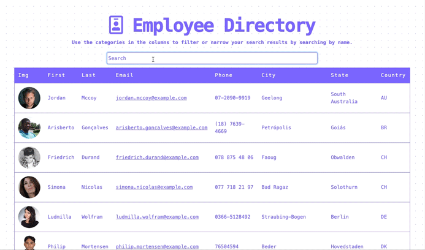

# User Directory

This simple application is an employee directory app populated with randomized users via [Random User Generator](https://randomuser.me/). User Directory uses React to create data that's easily searchable and sortable, so it's easy to find a particular person or a group with commonalities by just clicking!

This project was bootstrapped with [Create React App](https://github.com/facebook/create-react-app).

## Usage

You can clone the repo and runs the app in the development mode from your CLI by typing `npm run start`. [http://localhost:3000](http://localhost:3000) to view it in the browser.

The live deployed link is [karajsch.github.io/user-directory/](https://karajsch.github.io/user-directory/)

## Tools

- [React](https://reactjs.org/)
- [Axios](https://www.npmjs.com/package/axios)
- [Javascript](https://www.javascript.com/)
- [Node-JS](https://nodejs.org/en/)
- [Node-Package-Manager](https://www.npmjs.com/)
- [Bootstrap](https://getbootstrap.com/)
- [GitBash](https://git-scm.com/downloads)

## License

This project is licensed under MIT License. Not sure what that means? Please check out [choosealicense.com/licenses/](https://choosealicense.com/licenses/) for more information.
